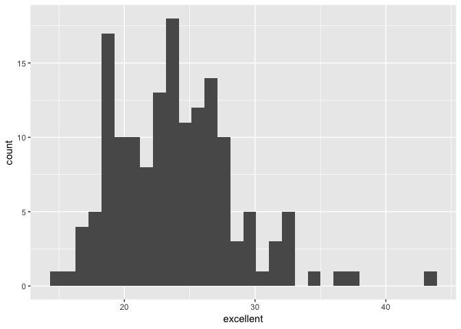

Homework 2
================
Eileen Shea
October 5, 2018

## Problem 1

First we need to read and clean the NYC transit data, while also
retaining only the necessary variables and converting the *entry*
variable from character to
logical:

``` r
subway_data = read_csv("./data/NYC_Transit_Subway_Entrance_And_Exit_Data.csv") %>% 
  janitor::clean_names() %>% 
  select(line:route11, entry, vending, entrance_type, ada) %>% 
  mutate(entry = recode(entry, "YES" = TRUE, "NO" = FALSE))
```

    ## Parsed with column specification:
    ## cols(
    ##   .default = col_character(),
    ##   `Station Latitude` = col_double(),
    ##   `Station Longitude` = col_double(),
    ##   Route8 = col_integer(),
    ##   Route9 = col_integer(),
    ##   Route10 = col_integer(),
    ##   Route11 = col_integer(),
    ##   ADA = col_logical(),
    ##   `Free Crossover` = col_logical(),
    ##   `Entrance Latitude` = col_double(),
    ##   `Entrance Longitude` = col_double()
    ## )

    ## See spec(...) for full column specifications.

The dataset we have right now is a subset of NYC Transit data that
relates information about entrances and exits for each subway station in
NYC. Variables that have been kept as part of our dataset are: line,
station\_name, station\_latitude, station\_longitude, route1-11, entry,
vending, entrance\_type, and ada. These data encompass numerous data
types, including character variables (e.g. line, station\_name), double
variables (e.g. station\_latitude, station\_longitude), integer
variables (e.g. route8, route11), and logical variables (e.g. ada,
entry). So far, the data cleaning steps have involved turning all of the
variable names into lower snake case, getting rid of extraneous
variables, and converting between character and logical variable for
*entry*. The dataset consits of 1868 rows and 19 columns. Right now, the
dataset is not particularly tidy, especially due to the fact that some
columns are values instead of variable names (i.e. route1-11 columns).

First, we are curious about how many distinct stations there are:

``` r
distinct_sub = subway_data %>% 
  distinct(line, station_name, .keep_all = TRUE)
```

From the above code chunk, we learn that there are **465** distinct
subway stations.

Next, we are curious about how many stations are ADA compliant:

``` r
sum(distinct_sub$ada)
```

    ## [1] 84

It turns out that there are only **84** ADA compliant subway stations
out of that bunch.

We are then curious about what proportion of station entrances / exits
without vending allow entrance:

``` r
no_vending = subway_data %>% 
  filter(vending == "NO")

sum(no_vending$entry)/length(no_vending$entry)
```

    ## [1] 0.3770492

From this code chunk we learn that the proportion of station entrances /
exits without vending that allow entrance is **0.377**.

Now it is important to reformat the dataset so that route number and
route name are distinct
variables:

``` r
subway_tidy_data = gather(subway_data, key = rt_number, value = route_name, route1:route11) %>% 
  separate(rt_number, into = c("remove", "route_number"), sep = 5) %>% 
  select(everything(), -remove)
```

We also are interested in identifying how many distinct stations serve
the A train:

``` r
A_train = subway_tidy_data %>% 
  distinct(line, station_name, .keep_all = TRUE) %>% 
  filter(route_name == "A")

nrow(A_train)
```

    ## [1] 60

The A train according to this dataset serves **60** distinct stations.

Of the stations that serve the A train, we are interested in which are
ADA compliant:

``` r
sum(A_train$ada)
```

    ## [1] 17

Out of 60 A train stations, **17** are ADA compliant.

## Problem 2

First we need to read and clean the Excel file by specifying the
Mr. Trash Wheel sheet and omitting the notes columns, using reasonable
variable names, omitting rows that do not include dumpster-specific
data, rounding the number of sports balls to the nearest integer, and
converting this result to an integer variable:

``` r
library(readxl)
mr_trash_wheel = 
  read_xlsx("./data/HealthyHarborWaterWheelTotals2018-7-28.xlsx", sheet = "Mr. Trash Wheel", range = "A2:N338") %>% 
  janitor::clean_names() %>% 
  filter(!is.na(dumpster)) %>% 
  mutate(sports_ball_count = as.integer(round(sports_balls))) %>% 
  select(everything(), -sports_balls)
```

Next we will read and clean the precipitation data for 2016 and 2017.
Steps include omitting rows without precipitation data (for 2016 and
2017 all rows have precipitation data) and adding a variable
year:

``` r
precip_2016 = read_xlsx("./data/HealthyHarborWaterWheelTotals2018-7-28.xlsx", sheet = "2016 Precipitation", range = "A2:B14") %>% 
  janitor::clean_names() %>% 
  mutate(year = 2016)

precip_2017 = read_xlsx("./data/HealthyHarborWaterWheelTotals2018-7-28.xlsx", sheet = "2017 Precipitation", range = "A2:B14") %>% 
  janitor::clean_names() %>% 
  mutate(year = 2017)
```

We must then combine the datasets and convert month to a character
variable:

``` r
precipm_2016 = precip_2016 %>% 
  mutate(month = month.name)
                
precipm_2017 = precip_2017 %>% 
  mutate(month = month.name)

harbor_data_2016 = inner_join(mr_trash_wheel, precipm_2016)
```

    ## Joining, by = c("month", "year")

``` r
harbor_data_2017 = inner_join(mr_trash_wheel, precipm_2017)
```

    ## Joining, by = c("month", "year")

``` r
rename(harbor_data_2016, total_precip = total)
```

    ## # A tibble: 51 x 15
    ##    dumpster month  year date                weight_tons volume_cubic_ya…
    ##       <dbl> <chr> <dbl> <dttm>                    <dbl>            <dbl>
    ##  1      116 Janu…  2016 2016-01-10 00:00:00        3.6                15
    ##  2      117 Febr…  2016 2016-02-02 00:00:00        4.06               18
    ##  3      118 Febr…  2016 2016-02-03 00:00:00        2.11               15
    ##  4      119 Febr…  2016 2016-02-05 00:00:00        3.01               15
    ##  5      120 Febr…  2016 2016-02-17 00:00:00        3.41               18
    ##  6      121 Febr…  2016 2016-02-19 00:00:00        3.66               15
    ##  7      122 Febr…  2016 2016-02-25 00:00:00        4.51               15
    ##  8      123 March  2016 2016-03-01 00:00:00        2.89               18
    ##  9      124 March  2016 2016-03-11 00:00:00        2.89               15
    ## 10      125 March  2016 2016-03-12 00:00:00        2.51               15
    ## # ... with 41 more rows, and 9 more variables: plastic_bottles <dbl>,
    ## #   polystyrene <dbl>, cigarette_butts <dbl>, glass_bottles <dbl>,
    ## #   grocery_bags <dbl>, chip_bags <dbl>, homes_powered <dbl>,
    ## #   sports_ball_count <int>, total_precip <dbl>

``` r
rename(harbor_data_2017, total_precip = total)
```

    ## # A tibble: 55 x 15
    ##    dumpster month  year date                weight_tons volume_cubic_ya…
    ##       <dbl> <chr> <dbl> <dttm>                    <dbl>            <dbl>
    ##  1      167 Janu…  2017 2017-01-19 00:00:00        2.43               15
    ##  2      168 Febr…  2017 2017-02-26 00:00:00        2.32               18
    ##  3      169 Febr…  2017 2017-02-26 00:00:00        3.72               15
    ##  4      170 March  2017 2017-03-30 00:00:00        2.14               15
    ##  5      171 March  2017 2017-03-31 00:00:00        2.74               18
    ##  6      172 March  2017 2017-03-31 00:00:00        2.63               15
    ##  7      173 March  2017 2017-03-31 00:00:00        2.09               15
    ##  8      174 April  2017 2017-04-01 00:00:00        2.67               18
    ##  9      175 April  2017 2017-04-01 00:00:00        2.67               18
    ## 10      176 April  2017 2017-04-06 00:00:00        3.55               15
    ## # ... with 45 more rows, and 9 more variables: plastic_bottles <dbl>,
    ## #   polystyrene <dbl>, cigarette_butts <dbl>, glass_bottles <dbl>,
    ## #   grocery_bags <dbl>, chip_bags <dbl>, homes_powered <dbl>,
    ## #   sports_ball_count <int>, total_precip <dbl>

We have two datasets right now; one is a combination of Mr. Trash Wheel
data and 2016 precipitation data (harbor\_data\_2016), while the other
is a combination of Mr. Trash Wheel data and 2017 precipitation data
(harbor\_data\_2017). Both are from the HealthyHarbor data collection’s
most recent update on July 28, 2018. The first dataset,
harbor\_data\_2016, has 51 observations while the second dataset,
harbor\_data\_2017, has 55 observations. Key variables in each dataset
include the dumpster number (*dumpster*), the month and year this
dumpster was collected (*month* and *year*), its weight in tons
(*weight\_tons*), its volume in cubic yards (*volume\_cubic\_yards*),
and the total precipitation in inches (*total\_precip*) for the
corresponding month and year. The total precipitation amount for 2017
was 32.93 inches. The median number of sports balls in a dumpster in
2016 was 26.

## Problem 3

First we need to load the data from the p8105.datasets package:

``` r
library(p8105.datasets)
data(brfss_smart2010)
```

Then we need to do the following manipulations: For this question: 1)
format the data to use appropriate variable names, 2) focus on the
“Overall Health” topic, 3) exclude variables for class, topic,
question, sample size, and everything from lower confidence limit to
GeoLocation, 4) structure data so that values for Response (“Excellent”
to “Poor”) are column names / variables which indicate the proportion of
subjects with each response (which are values of Data\_value in the
original dataset), 5) create a new variable showing the proportion of
responses that were “Excellent” or “Very Good”.

``` r
brfss_clean = brfss_smart2010 %>% 
  janitor::clean_names() %>% 
  filter(topic == "Overall Health") %>% 
  select(-class, -topic, -question, -sample_size, -(confidence_limit_low:geo_location)) %>% 
  spread(key = response, value = data_value) %>% 
  janitor::clean_names() %>% 
  mutate(excell_vgood = (excellent + very_good)/100)
```

### Now we are interested in the following questions/actions:

How many unique locations are included in the dataset? Is every state
represented? What state is observed the most?

``` r
brfss_clean %>% 
  distinct(locationdesc, .keep_all = TRUE) 
```

    ## # A tibble: 404 x 9
    ##     year locationabbr locationdesc excellent  fair  good  poor very_good
    ##    <int> <chr>        <chr>            <dbl> <dbl> <dbl> <dbl>     <dbl>
    ##  1  2002 AK           AK - Anchor…      27.9   8.6  23.8   5.9      33.7
    ##  2  2002 AL           AL - Jeffer…      18.5  12.1  32.7   5.9      30.9
    ##  3  2002 AR           AR - Pulask…      24.1  12.5  29.9   4.2      29.3
    ##  4  2002 AZ           AZ - Marico…      21.6  10.3  26.9   4.6      36.6
    ##  5  2002 AZ           AZ - Pima C…      26.6   7.5  31.9   3.9      30.1
    ##  6  2002 CA           CA - Los An…      22.7  14.3  28.7   4.5      29.8
    ##  7  2002 CO           CO - Adams …      21.2  14.4  29     4.2      31.2
    ##  8  2002 CO           CO - Arapah…      25.5   8    29.3   2.1      35.2
    ##  9  2002 CO           CO - Denver…      22.2  11.1  36.6   3        27.1
    ## 10  2002 CO           CO - Jeffer…      23.4  11.4  26.3   2.4      36.6
    ## # ... with 394 more rows, and 1 more variable: excell_vgood <dbl>

``` r
brfss_clean %>% 
  distinct(locationdesc, .keep_all = TRUE) %>% 
  distinct(locationabbr, .keep_all = TRUE)
```

    ## # A tibble: 51 x 9
    ##     year locationabbr locationdesc excellent  fair  good  poor very_good
    ##    <int> <chr>        <chr>            <dbl> <dbl> <dbl> <dbl>     <dbl>
    ##  1  2002 AK           AK - Anchor…      27.9   8.6  23.8   5.9      33.7
    ##  2  2002 AL           AL - Jeffer…      18.5  12.1  32.7   5.9      30.9
    ##  3  2002 AR           AR - Pulask…      24.1  12.5  29.9   4.2      29.3
    ##  4  2002 AZ           AZ - Marico…      21.6  10.3  26.9   4.6      36.6
    ##  5  2002 CA           CA - Los An…      22.7  14.3  28.7   4.5      29.8
    ##  6  2002 CO           CO - Adams …      21.2  14.4  29     4.2      31.2
    ##  7  2002 CT           CT - Fairfi…      31.9   8.4  22.7   2.5      34.5
    ##  8  2002 DC           DC - Distri…      29.3   8.3  28.1   2.4      31.8
    ##  9  2002 DE           DE - Kent C…      20.2  11    32.5   3.7      32.7
    ## 10  2002 FL           FL - Browar…      25.7   7.7  31     3.8      31.7
    ## # ... with 41 more rows, and 1 more variable: excell_vgood <dbl>

``` r
brfss_clean %>% 
  distinct(locationdesc, .keep_all = TRUE) %>% 
  group_by(locationabbr) %>% 
  count(locationabbr)
```

    ## # A tibble: 51 x 2
    ## # Groups:   locationabbr [51]
    ##    locationabbr     n
    ##    <chr>        <int>
    ##  1 AK               2
    ##  2 AL               4
    ##  3 AR               3
    ##  4 AZ               6
    ##  5 CA              12
    ##  6 CO              10
    ##  7 CT               7
    ##  8 DC               1
    ##  9 DE               3
    ## 10 FL              44
    ## # ... with 41 more rows

From this code chunk we learn that there are 404 unique locations in the
dataset. All 50 states are represented in the data, in addition to the
District of Columbia. Florida is observed the most at 44 unique
locations.

In 2002, what is the median of the “Excellent” response value?

Make a histogram of “Excellent” response values in the year 2002.

``` r
brfss_clean %>% 
  filter(year == 2002) %>%
  ggplot(aes(x = excellent)) + geom_histogram()
```

    ## `stat_bin()` using `bins = 30`. Pick better value with `binwidth`.

    ## Warning: Removed 2 rows containing non-finite values (stat_bin).

<!-- -->

Make a scatterplot showing the proportion of “Excellent” response values
in New York County and Queens County (both in NY State) in each year
from 2002 to 2010.
